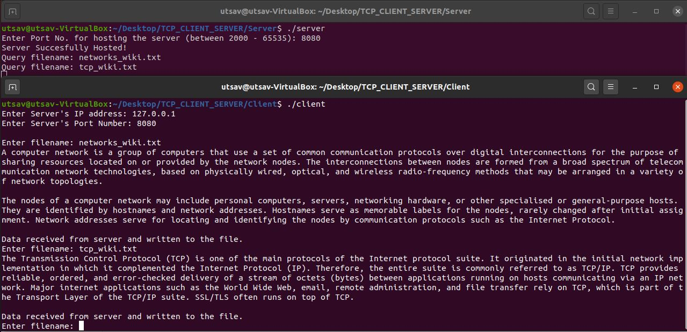
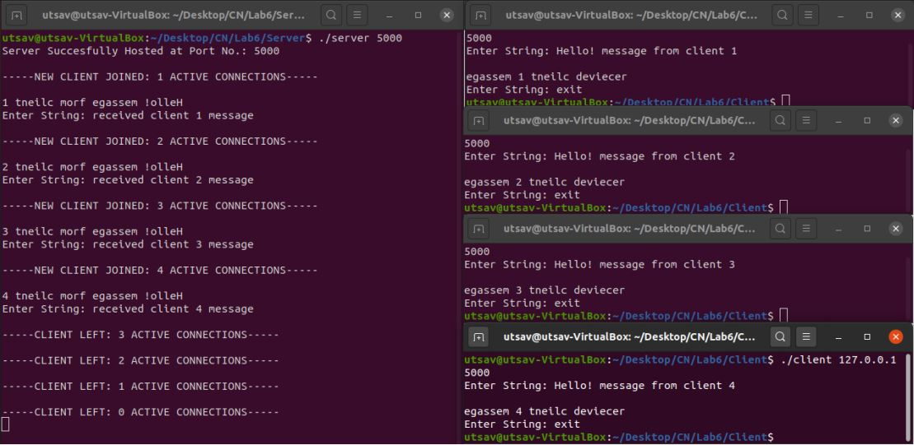

# TCP-client-server

## 1. Get data from file in server by querying it from client.
Server has txt files. Client queries the server and server sends upto 1KB of data in the queried file to the client. Client saves the file in its local directory.

## 2. Multiple Clients echo server
Server accepts upto 4 clients. Client send a line to the server, Server prints the line in reverse order. Server replies with a line. Client prints it in reverse order.

